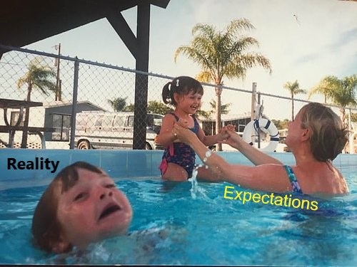
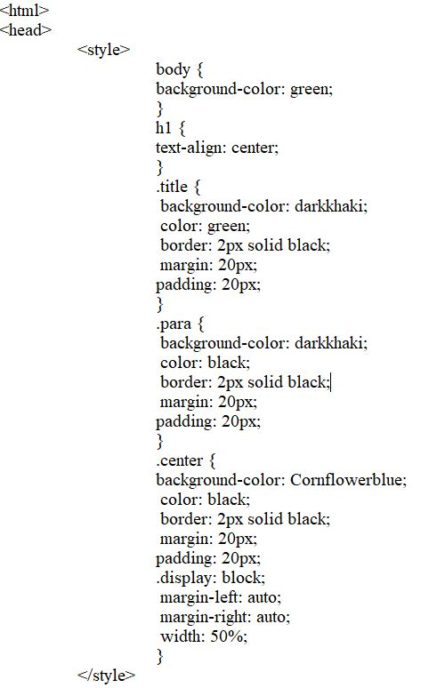

# Thursday August 24th 2242

## First Week
This first week hasn't been my expectation. This isn't to imply a negative connotation, but just an observation. It reminds me of when my sister taught me how to swim. She pushed me in the deep end and if I didn't come back up she fished me out. Long story short, I learned to swim.

> How I felt all this week... it's okay to laugh

## Looking to the future
I'm not sure if excited or eager is the right way to desribe how I feel for the upcoming content, I would use ambivalent. This feeling comes from not understanding the intricancies of tools and knowing I will have to move on anyways. It may come to me as we go, but I'm not clairvoyant so I'm gonna focus on not being so tempermental when faced with adversity.

## Fun Fact About Me
I used to convert .exe's into .app's IOT to play windows games on my mom's mac in middle school
> Check out this link if you're curious [WineBottler]https://winebottler.kronenberg.org/

### Cool Code Snippet?
Not sure what you want, but here is what it took to center an image. This is important because I discovered you can't center an image in html unless you resize it first.

> During the application process, I had technical issues with the site provided which led me to discover you could use notepad and just change the file from .txt to .html IOT make a landing page on my local system.